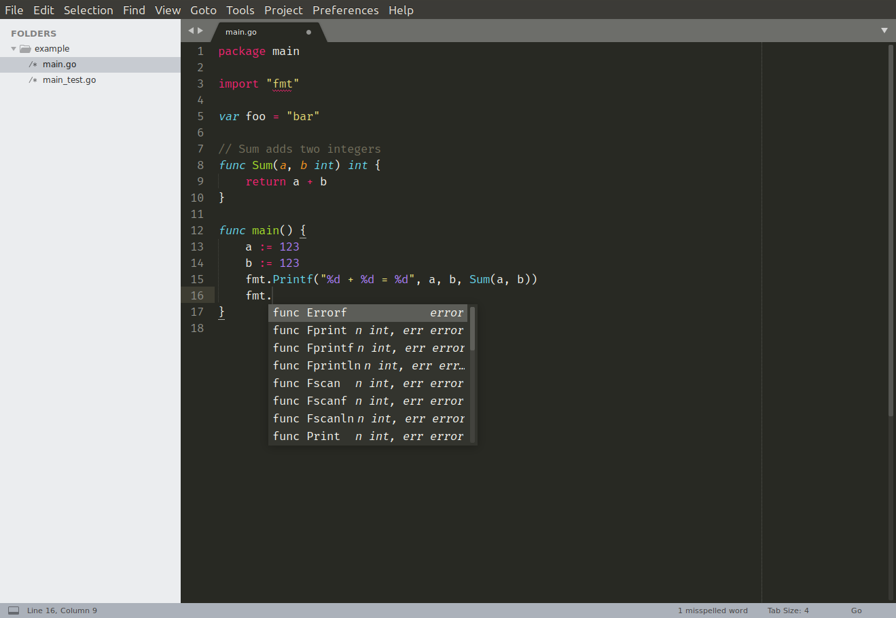
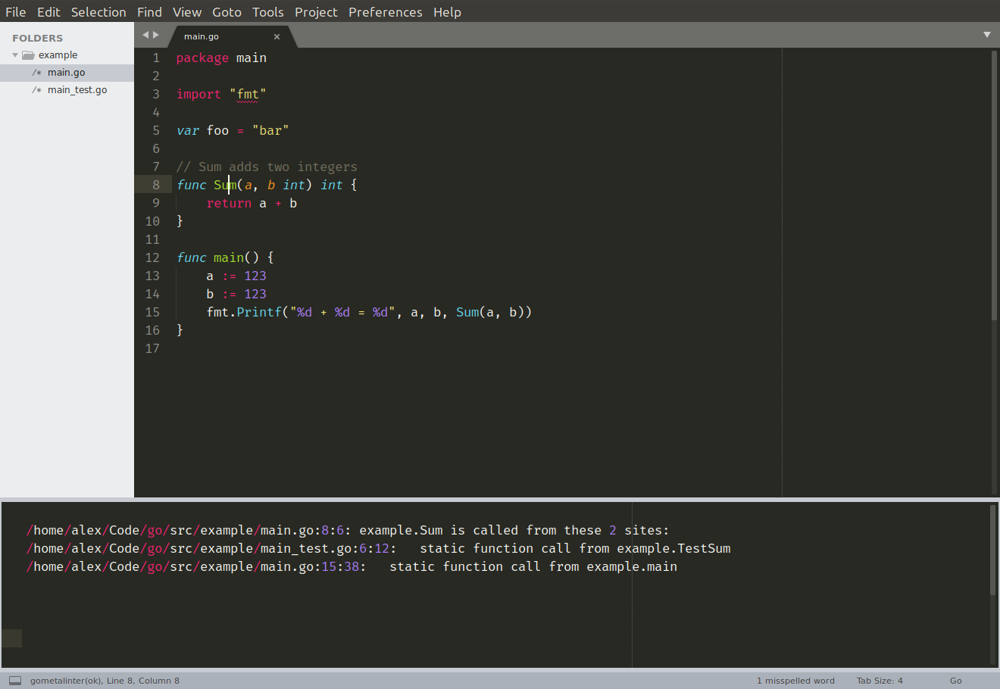

# go

### 1.Snippets
If you want to define your own snippets, plugin PackageResourceViewer is a good choice, you can install it with following steps:


1. Open command palette by pressing `Ctrl+Shift+P`.
2. Run the Package Control: `Install Package command`.
3. Type `PackageResourceViewer` and hit Enter to install the package.


Once installed you can open the command palette and run `PackageResourceViewer: Open Resource ` which will list all packages on your system. If you navigate through `Go > Snippets/` you should see a list of all the built-in snippets and you can open and edit them as you wish.

Hint: You can also use PackageResourceViewer to edit your own custom snippets without leaving SublimeText. If – for example – your custom snippets are saved under your `Packages/User` directory, you can open them by running PackageResourceViewer: Open Resource and navigating to the User folder.

##### Snippets Example:

```
<snippet>
    <content><![CDATA[
func ${1:name}(w http.ResponseWriter, r *http.Request) {
    ${2:}
}
]]></content>
    <tabTrigger>hf</tabTrigger>
    <scope>source.go</scope>
</snippet>
```
##### define your own Snippets:
```
# cd into the built-in snippets folder
cd ~/Library/Application\ Support/Sublime\ Text\ 3/Packages/Go/Snippets/
ls
//go-defun.sublime-snippet go-fori.sublime-snippet
vim go-handle.sublime-snippet
```
```
<snippet>
    <content><![CDATA[
func ${1:name}(w http.ResponseWriter, r *http.Request) {
    ${2:}
}
]]></content>
    <tabTrigger>handler</tabTrigger>
    <scope>source.go</scope>
</snippet>

```
now you can use `handle+tab` to generator the code

### 2.Automatic formatting
For automatic formatting of .go files I've been using the Gofmt plugin. You can install it as follows:

1. Open the Sublime Text command palette by pressing `Ctrl+Shift+P`.
2. Run the Package Control: `Install Package` command.
3. Type Gofmt and hit Enter to install the package.
By default this will run `go fmt -s -e` on the current file each time it is saved.

I've customised this further to use the goimports tool. If you're not already familiar with goimports, it runs go fmt and fixes your import lines — adding missing packages and removing unreferenced ones as necessary.

To set this up you'll need to install goimports and make sure it's available on your system path:

```
$ go get golang.org/x/tools/cmd/goimports
$ which goimports
/home/alex/Code/go/bin/goimports
```
When that's installed, you'll then need to change the Gofmt plugin settings in Sublime Text by opening `Preferences > Package Settings > Gofmt > Settings - User` and adding the following configuration settings:
```
{
  "cmds": [
    ["goimports"]
  ],
  "format_on_save": true
}
```
(You'll probably need to restart Sublime Text for this to take effect.)

Each time you now save a .go file, you'll find that it gets automatically formatted and the import packages are updated. No more "imported and not used" errors!

### 3.Autocompletion
For autocompletion I'm using the gocode package, which provides a deamon for code completion. You can install it like so:
```
$ go get github.com/mdempsky/gocode
$ which gocode
/home/alex/Code/go/bin/gocode
```
There isn't currently a gocode plugin available via Sublime Text package control (I might add one soon!)… but there is a plugin included in the subl3 directory within the gocode source itself.

You should be able to copy it into your Sublime Text Packages directory with the following command:

```
mkdir -p ~/.config/sublime-text-3/Packages/gocode
$ cp -r $GOPATH/src/github.com/mdempsky/gocode/subl3 ~/.config/sublime-text-3/Packages/gocode
```
You can make that happen by going to Preferences > Settings and adding a new trigger in the Preferences.sublime-settings - User file:

```
{
    ...
    "auto_complete_triggers": [
        {"selector": "text.html", "characters": "<"},
        {"selector": "source.go", "characters": "."}
    ],
}
```
You'll need to then restart Sublime Text for the settings to take effect. Once you have, you should have autocomplete working nicely and looking something like this:



### 4.Code navigation
To help with navigating code I use the guru tool, which you can install with the following command:

```
$ go get golang.org/x/tools/cmd/guru
$ which guru
/home/alex/Code/go/bin/guru
```
To integrate this with Sublime Text you'll also need to install the GoGuru plugin like so:

Open command palette by pressing Ctrl+Shift+P.
Run the Package Control: Install Package command.
Type GoGuru and hit Enter to install the package.
To use the GoGuru tool, first place your cursor over the piece of code you're interested in. Then if you open the command palette and type the GoGuru prefix you'll see a list of available commands, including:

`GoGuru: callees` – Show possible targets of selected function call
`GoGuru: callers` – Show possible callers of selected function
`GoGuru: callstack` – Show path from callgraph root to selected function
`GoGuru: definition` – Show declaration of selected identifier
`GoGuru: describe` – Describe selected syntax: definition, methods, etc
`GoGuru: freevars` – Show free variables of selection
`GoGuru: implements` – Show 'implements' relation for selected type or method
`GoGuru: jump to definition` – Open the file at the declaration of selected identifier
`GoGuru: peers` – Show send/receive corresponding to selected channel op
`GoGuru: pointsto` – Show variables the selected pointer may point to
`GoGuru: referrers` – Show all refs to thing denoted by selected identifier
`GoGuru: what` – Show basic information about the selected syntax node
`GoGuru: whicherrs` – Show possible values of the selected error variable
You can find a detailed description these commands and their behaviour in this GoogleDoc.

I don't use the GoGuru plugin as often as the others, but when working on a unfamiliar codebase it definitely makes navigating code and building up a mental map of how things work easier. I find the GoGuru: jump to definition and GoGuru: callers commands particularly useful, and easier to use than grepping or running `Ctrl+F`on the repository.

As an illustration, here's a screenshot of running GoGuru: callers on the Sum function:


